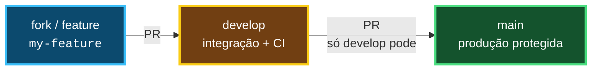

# Guia de Contribuição — APATA Frontend

## 1. Fluxo de branches

Trabalhamos com 2 branches permanentes e branches curtas de trabalho:

- `main`: espelha produção. Só recebe código estável via release. **Protegida** — sem push direto, sem commit direto, sem PR direto de feature.
- `develop`: branch de integração. É para onde todo PR de funcionalidade aponta e onde a CI precisa estar verde.
- `my-feature`, `fix/...`, `chore/...`: branches temporárias criadas a partir da `main` (no seu fork ou clone). Vivem pouco: nascem, passam por PR e são apagadas após o merge.

Fluxo obrigatório:



Regras:

- Crie sua branch sempre a partir da `develop` atualizada (`git checkout -b my-feature upstream/develop`).
- Todo PR de trabalho mira `develop` — nunca `main`.
- Só o mantenedor abre PR de `develop` → `main` para publicar uma release. Qualquer outro PR para `main` é reprovado automaticamente.
- Nunca faça commit direto na `main` ou na `develop` do repositório principal. Sempre via Pull Request com CI verde.

> **Resumo:** todas as branches devem ser mergeadas na `develop`. Apenas o dono do repositório mergeia a `develop` na `main`.

O workflow `Enforce PR base: develop` (`.github/workflows/enforce-pr-base.yml`) valida isso em todo PR e falha se a base estiver errada.

## 2. Pipeline CI/CD

Workflow `CI` (`.github/workflows/infra.yml`).

### Quando roda

- `push` para `main` e `develop`
- `pull_request` mirando `main` e `develop` (inclui PRs vindos de forks)

### O que valida (nessa ordem)

1. `npm ci` — instalação limpa das dependências (Node 22)
2. `npm run typecheck` — `tsc --noEmit`
3. `npm run lint` — `eslint .`
4. `npm run test:run` — `vitest run`
5. `npm run build` — `next build`

Qualquer etapa que falhar reprova a run inteira. Não há `continue-on-error`.

### Concurrency

```yaml
concurrency:
  group: ${{ github.workflow }}-${{ github.ref }}
  cancel-in-progress: true
```

Push novo na mesma branch/PR cancela as runs antigas. Só a última vale.

### Proteção da `main` (configuração manual no GitHub)

Isso não é código, precisa ser ativado em `Settings → Branches → Add branch protection rule` para `main`:

- [ ] Require a pull request before merging (sem bypass, nem para admins)
- [ ] Require status checks to pass: `build` (workflow `CI`)
- [ ] Restrict pushes / Block force pushes
- [ ] Só permitir merge de `develop` → `main` (o workflow de enforce já bloqueia o resto)

Sem isso a proteção via Actions é só aviso, não bloqueio real.

## 3. Como contribuir via fork

1. Faça fork do repositório (botão Fork no GitHub).
2. Clone seu fork:
   ```bash
   git clone https://github.com/YOUR-USER/Apata-Frontend.git
   cd Apata-Frontend
   git remote add upstream https://github.com/ORIGIN-OWNER/Apata-Frontend.git
   ```
3. Sincronize e crie sua branch a partir da `develop`:
   ```bash
   git fetch upstream
   git checkout -b my-feature upstream/develop
   ```
4. Desenvolva e valide local (mesmo que a CI roda):
   ```bash
   npm ci
   npm run typecheck
   npm run lint
   npm run test:run
   npm run build
   ```
5. Commit, push para seu fork e abra o PR:
   ```bash
   git push origin my-feature
   ```
   No GitHub, abra o PR com **base: `develop`** do repositório original (nunca `main`).
6. Aguarde a CI. Se falhar, corrija e faça push — a run antiga é cancelada e uma nova começa.
7. Após merge na `develop`, sua branch pode ser apagada. O mantenedor promove `develop` → `main` quando for release.

Dúvidas: abra uma issue antes do PR para alinhar o escopo.
